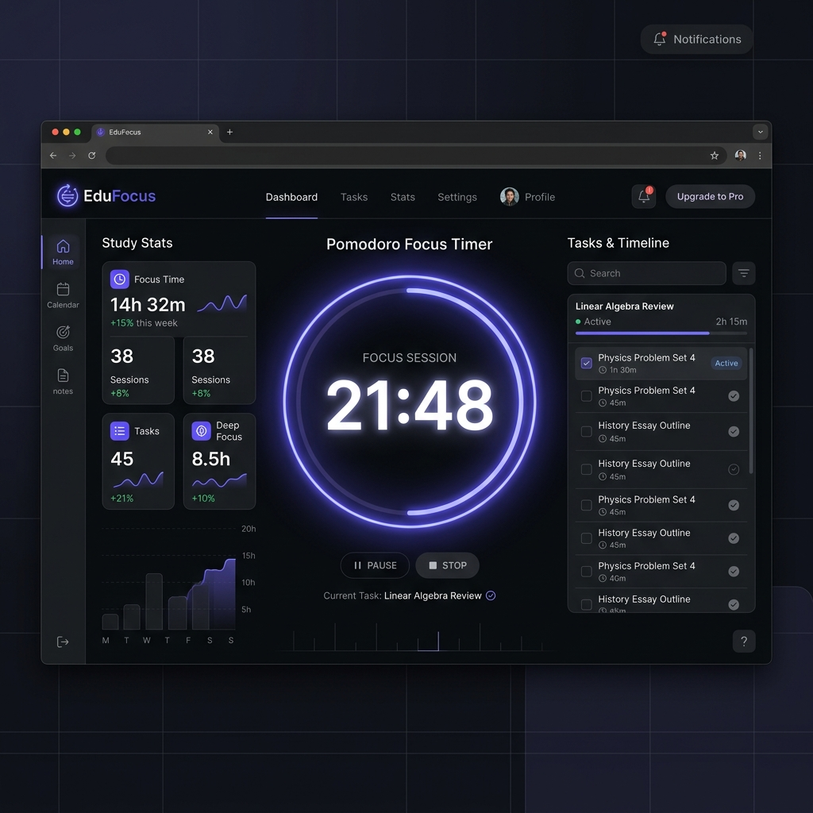
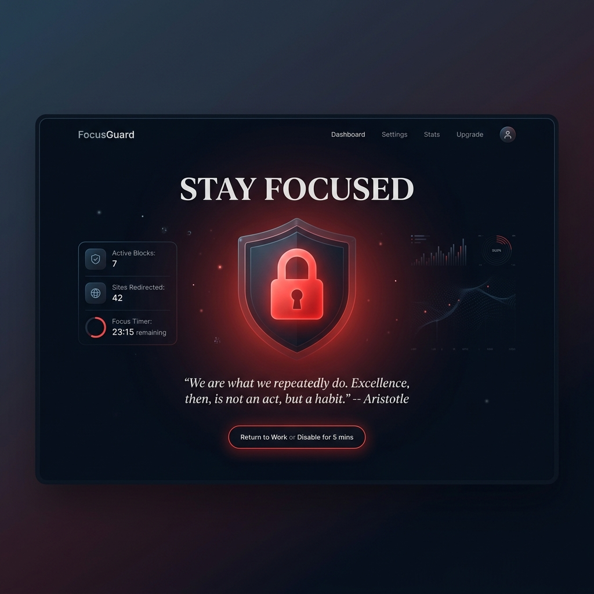

# 🎓 EduFocus - Student Website Blocker & Pomodoro Timer

[](https://vijaymahes9080.github.io/website-blocker-for-study_extension/)
[](https://developer.chrome.com/docs/extensions/mv3/intro/)
[](LICENSE)

EduFocus is a premium Google Chrome Extension and web study companion designed to eliminate digital distractions, boost your focus, and track study milestones. Combining an active Pomodoro Timer with an intelligent website blocker, it supports standard blocklists (blacklist) and strict allowlists (whitelist) to cultivate productive habits.

---

## 📸 Interface Previews

### 1. Interactive Study Workspace & Extension Panel
Simulate focus intervals, add tasks, and manage website rules inside the integrated study workspace.



### 2. Motivational Block Landing Page
Whenever you attempt to access restricted domains during active focus sessions, EduFocus intercepts the request and redirects you to a beautiful focus portal featuring rotating quotes.



---

## ⚡ Key Features

- 🎓 **Double-Mode Blocker**:
  - **Block Mode (Blocklist)**: Blocks specific distracting domains (e.g. `facebook.com`, `youtube.com`, `reddit.com`) to filter out attention hogs.
  - **Strict Mode (Allowlist)**: Restricts *all* domains except research and documentation websites you explicitly whitelist (e.g. `wikipedia.org`, `github.com`).
- ⏱️ **Integrated Pomodoro Timer**: A glowing circular progress timer configurable for Focus intervals (25m), Short Breaks (5m), and Long Breaks (15m).
- 🔊 **Web Audio Chimes**: Synthesizes soft digital bell alarms when focus blocks and break periods finish.
- 📋 **Integrated Tasks Tracker**: Simple built-in todo manager to create study tasks, assign estimates, and track focused time on each.
- 📊 **Focused Statistics**: Automatically tracks completed study sessions, daily streak count, and total hours focused.
- 💎 **Premium Modern Dark UI**: Sleek dark aesthetic designed with Outfit typography, elegant glassmorphic panels, and glowing outlines.

---

## 🔧 Installation Guide (Developer Mode)

You can load this Chrome Extension directly into your browser using Developer Mode without going through the Web Store:

1. **Download the Extension Source**:
   - Download the repository as a ZIP archive: [Download ZIP](https://github.com/vijaymahes9080/website-blocker-for-study_extension/archive/refs/heads/main.zip)
   - Or clone the repository locally using Git:
     ```bash
     git clone https://github.com/vijaymahes9080/website-blocker-for-study_extension.git
     ```
2. **Extract Files**:
   - Extract the downloaded ZIP file to a convenient directory on your machine (e.g., `C:\Projects\EduFocus`).
3. **Open Chrome Extensions Manager**:
   - Open Google Chrome and navigate to: `chrome://extensions/`
4. **Enable Developer Mode**:
   - Toggle the **Developer mode** switch in the top-right corner to **ON**.
5. **Load the Unpacked Folder**:
   - Click the **Load unpacked** button in the top-left corner.
   - Select the extracted folder containing the extension code (the directory with the `manifest.json` file).
6. **Start Studying**:
   - Click the extension puzzle icon in Chrome, pin **EduFocus**, and open it to begin!

---

## 📁 Repository Structure

- [chrome-polyfill.js](chrome-polyfill.js): Handles extension API mock fallback for hosting the workspace directly in standard web browsers.
- [manifest.json](manifest.json): Configuration, permissions, assets, and service worker registration for Manifest V3.
- [background.js](background.js): Manages background alarm clocks, focus states, and Chrome DeclarativeNetRequest blocking rules.
- [popup.html](popup.html) / [popup.js](popup.js) / [popup.css](popup.css): The user interface, script logs, and layout of the extension.
- [blocked.html](blocked.html): Redirection landing page shown when a blocked website is accessed.
- [index.html](index.html): Interactive study workspace simulator hosted on GitHub Pages.
- [images/](images/): Visual assets and mockups for the project documentation.
- [icons/](icons/): Chrome toolbar action icon files (16px, 48px, 128px).

---

## 🚀 Live Web Sandbox
Want to test it out before installing? Visit the live workspace simulator hosted directly on GitHub Pages:
👉 **[Try the Live Web Sandbox](https://vijaymahes9080.github.io/website-blocker-for-study_extension/)**
